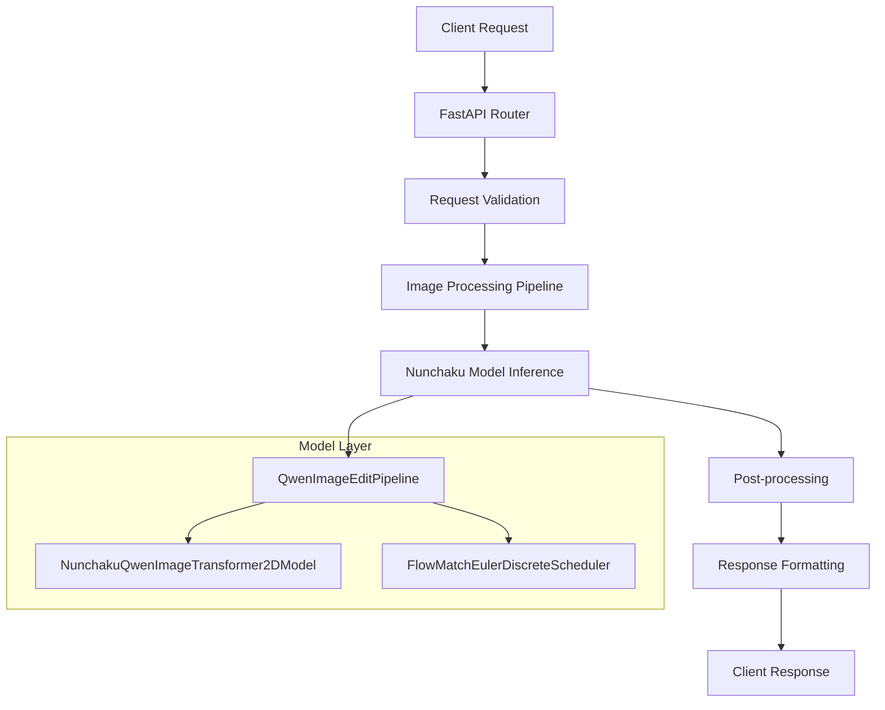
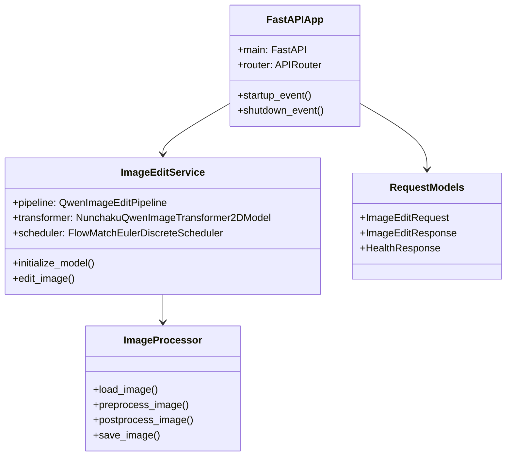
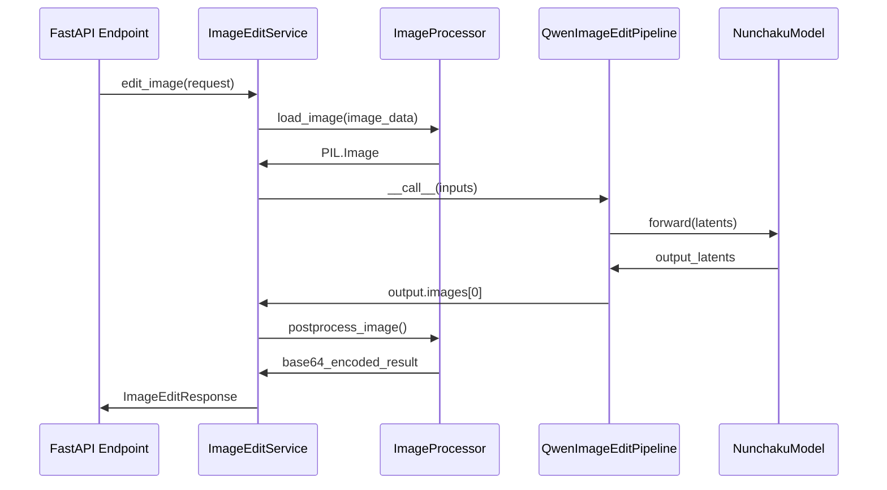
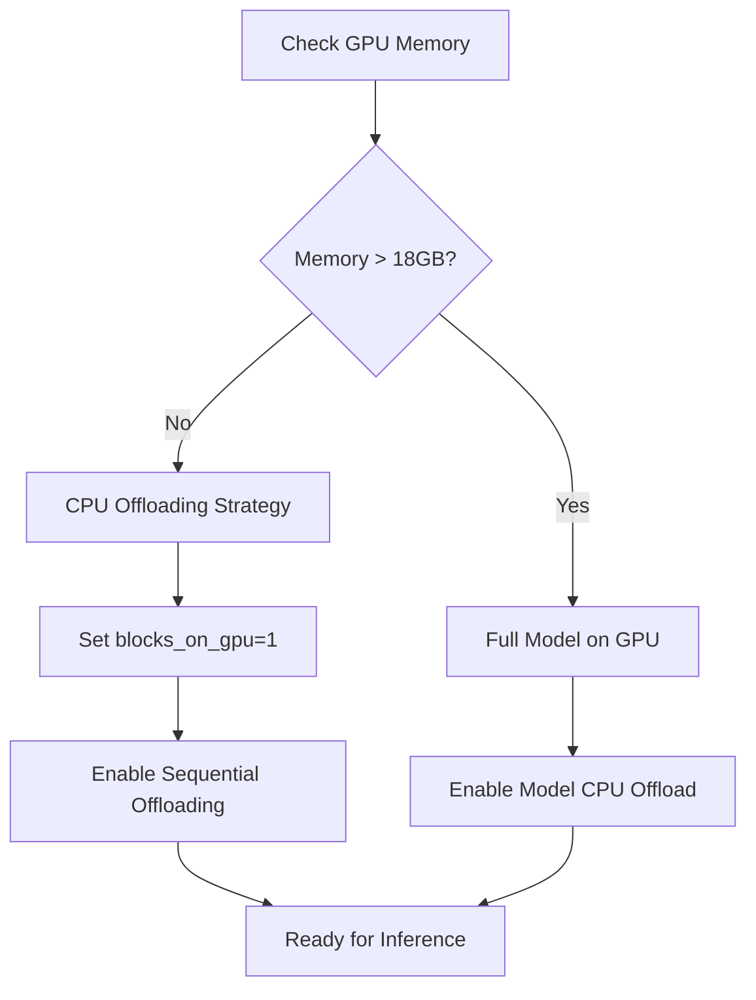
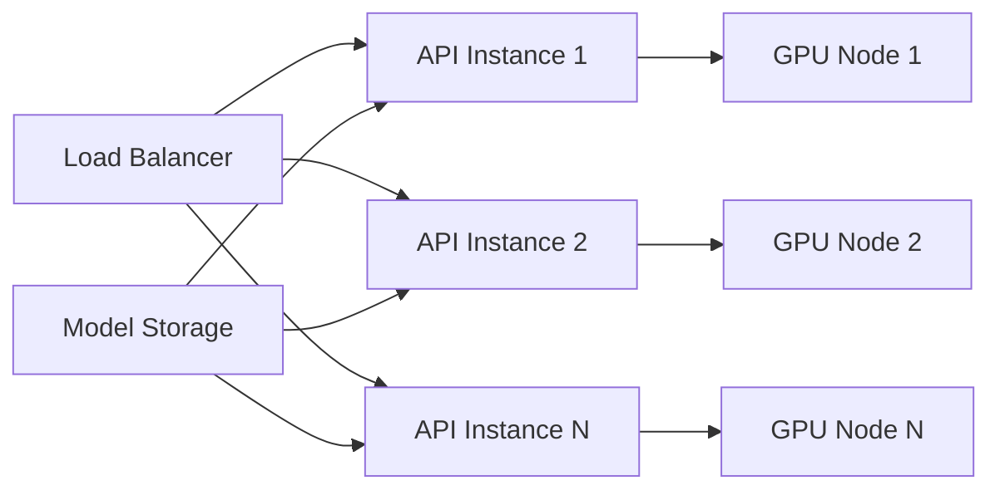

# Qwen Image Edit Nunchanku API Design

## Overview

This design document outlines the development of a FastAPI-based image editing service using Qwen Image Edit Nunchanku. The service will provide a lightweight, efficient alternative to the current ComfyUI-based approach, offering direct REST API endpoints for image editing operations with improved performance and reduced complexity.

## Technology Stack & Dependencies

### Core Dependencies
- **FastAPI**: Web framework for API development
- **Uvicorn**: ASGI server for FastAPI
- **Nunchaku**: Optimized inference engine for Qwen models
- **Diffusers**: Hugging Face diffusion models library
- **PyTorch**: Deep learning framework (≥2.5)
- **Pillow**: Image processing library
- **Pydantic**: Data validation library

### Infrastructure
- **Docker**: Container deployment
- **CUDA**: GPU acceleration (≥12.2)
- **Python**: 3.11+ runtime environment

## Architecture

### System Architecture



### Component Architecture



## API Endpoints Reference

### Health Check Endpoint

| Method | Endpoint | Description |
|--------|----------|-------------|
| GET    | `/health` | Service health status |

**Response Schema:**
```json
{
  "status": "healthy",
  "model_loaded": true,
  "gpu_available": true,
  "memory_usage": "4.2GB"
}
```

### Image Edit Endpoint

| Method | Endpoint | Description |
|--------|----------|-------------|
| POST   | `/edit-image` | Edit image based on text prompt |

**Request Schema:**
```json
{
  "image": "base64_encoded_image_or_url",
  "prompt": "change the text to read 'Hello World'",
  "negative_prompt": "",
  "num_inference_steps": 8,
  "true_cfg_scale": 1.0,
  "seed": null,
  "rank": 128
}
```

**Response Schema:**
```json
{
  "success": true,
  "edited_image": "base64_encoded_result",
  "processing_time": 2.3,
  "model_info": {
    "steps": 8,
    "rank": 128,
    "model_version": "lightningv1.0"
  }
}
```

### Model Configuration Endpoint

| Method | Endpoint | Description |
|--------|----------|-------------|
| GET    | `/model-info` | Get current model configuration |
| POST   | `/model-config` | Update model parameters |

## Data Models & Validation

### Request Models

```python
class ImageEditRequest(BaseModel):
    image: Union[str, HttpUrl]  # Base64 or URL
    prompt: str = Field(..., min_length=1, max_length=500)
    negative_prompt: str = Field(default="", max_length=500)
    num_inference_steps: int = Field(default=8, ge=1, le=50)
    true_cfg_scale: float = Field(default=1.0, ge=0.1, le=10.0)
    seed: Optional[int] = Field(default=None, ge=0, le=2**32-1)
    rank: int = Field(default=128, choices=[64, 128])
```

### Response Models

```python
class ImageEditResponse(BaseModel):
    success: bool
    edited_image: Optional[str] = None
    error_message: Optional[str] = None
    processing_time: float
    model_info: Dict[str, Any]
```

### Error Models

```python
class ErrorResponse(BaseModel):
    error: str
    detail: str
    timestamp: datetime
    request_id: str
```

## Business Logic Layer

### Image Processing Pipeline



### Model Management Strategy

#### Model Loading
- **Lazy Loading**: Models loaded on first request
- **Memory Management**: CPU offloading based on available VRAM
- **Multi-Step Support**: Support for 4-step and 8-step models
- **Rank Selection**: Dynamic rank selection (64/128) based on quality requirements

#### Performance Optimization
```python
# Memory optimization strategy
if get_gpu_memory() > 18:
    pipeline.enable_model_cpu_offload()
else:
    transformer.set_offload(
        True, 
        use_pin_memory=False, 
        num_blocks_on_gpu=1
    )
    pipeline.enable_sequential_cpu_offload()
```

### Error Handling Strategy

#### Exception Categories
1. **Validation Errors**: Invalid input parameters
2. **Model Errors**: Model loading or inference failures
3. **Resource Errors**: Insufficient GPU memory
4. **I/O Errors**: Image loading/saving failures

#### Recovery Mechanisms
- **Graceful Degradation**: Fallback to CPU inference
- **Memory Cleanup**: Automatic garbage collection
- **Request Retry**: Built-in retry logic for transient failures

## Docker Configuration

### Multi-Stage Dockerfile

``dockerfile
# Build Stage
FROM nvidia/cuda:12.6.0-cudnn-devel-ubuntu22.04 AS builder

ARG TORCH_VERSION=2.7.0
ARG CUDA_VERSION=cu128

# Install build dependencies
RUN apt-get update && apt-get install -y \
    python3 python3-venv python3-pip \
    build-essential git curl && \
    rm -rf /var/lib/apt/lists/*

# Create virtual environment
ENV VENV_PATH=/opt/venv
RUN python3 -m venv ${VENV_PATH}

# Install PyTorch and dependencies
RUN . ${VENV_PATH}/bin/activate && \
    pip install --upgrade pip && \
    pip install torch==${TORCH_VERSION}+${CUDA_VERSION} \
    torchvision torchaudio \
    --index-url https://download.pytorch.org/whl/${CUDA_VERSION}

# Install Nunchaku wheel
RUN . ${VENV_PATH}/bin/activate && \
    pip install https://github.com/nunchaku-tech/nunchaku/releases/download/v0.3.1/nunchaku-0.3.1+torch2.7-cp311-cp311-linux_x86_64.whl

# Install application dependencies
COPY requirements.txt .
RUN . ${VENV_PATH}/bin/activate && \
    pip install -r requirements.txt

# Runtime Stage
FROM nvidia/cuda:12.6.0-cudnn-runtime-ubuntu22.04

# Install runtime dependencies
RUN apt-get update && apt-get install -y \
    python3 curl tini && \
    rm -rf /var/lib/apt/lists/*

# Copy virtual environment
COPY --from=builder /opt/venv /opt/venv
ENV PATH="/opt/venv/bin:$PATH"

# Copy application code
WORKDIR /app
COPY . .

# Set environment variables
ENV PYTHONUNBUFFERED=1 \
    CUDA_VISIBLE_DEVICES=0 \
    TORCH_CUDA_ARCH_LIST="7.5;8.0;8.6;8.9" \
    MODEL_CACHE_DIR=/app/models

EXPOSE 8000

ENTRYPOINT ["/usr/bin/tini", "-s", "--"]
CMD ["python", "main.py"]
```

### Environment Configuration

| Variable | Default | Description |
|----------|---------|-------------|
| `API_HOST` | `0.0.0.0` | API server host |
| `API_PORT` | `8000` | API server port |
| `MODEL_CACHE_DIR` | `/app/models` | Model cache directory |
| `MAX_IMAGE_SIZE` | `2048` | Maximum input image dimension |
| `DEFAULT_STEPS` | `8` | Default inference steps |
| `DEFAULT_RANK` | `128` | Default model rank |
| `ENABLE_GPU_MONITORING` | `true` | Enable GPU memory monitoring |

## Performance Optimization

### GPU Memory Management



### Caching Strategy

#### Model Caching
- **Persistent Storage**: Models cached between container restarts
- **Lazy Loading**: Load models only when needed
- **Version Management**: Support multiple model versions

#### Image Caching
- **Request Deduplication**: Cache identical requests
- **LRU Eviction**: Least recently used eviction policy
- **Memory Limits**: Configurable cache size limits

### Benchmark Performance

| Configuration | VRAM Usage | Processing Time | Quality Score |
|---------------|------------|-----------------|---------------|
| 4-step, Rank 64 | 3.2GB | 1.8s | 8.2/10 |
| 4-step, Rank 128 | 3.8GB | 2.1s | 8.7/10 |
| 8-step, Rank 64 | 3.5GB | 3.2s | 8.8/10 |
| 8-step, Rank 128 | 4.2GB | 3.7s | 9.2/10 |

## Testing Strategy

### Unit Testing

```python
class TestImageEditService:
    def test_model_initialization(self):
        # Test model loading and configuration
        
    def test_image_preprocessing(self):
        # Test image format handling
        
    def test_inference_pipeline(self):
        # Test end-to-end inference
        
    def test_error_handling(self):
        # Test various error scenarios
```

### Integration Testing

```python
class TestAPIIntegration:
    def test_health_endpoint(self):
        # Test health check functionality
        
    def test_image_edit_endpoint(self):
        # Test complete API workflow
        
    def test_concurrent_requests(self):
        # Test multiple simultaneous requests
        
    def test_memory_management(self):
        # Test GPU memory handling under load
```

### Performance Testing

#### Load Testing Scenarios
- **Single User**: Baseline performance measurement
- **Concurrent Users**: 10, 50, 100 simultaneous requests
- **Memory Stress**: Large image processing
- **Extended Runtime**: Long-duration stability testing

#### Monitoring Metrics
- Response time (p95, p99)
- GPU memory utilization
- CPU usage patterns
- Error rates and types

## Deployment Architecture

### Container Orchestration



### Scaling Strategy

#### Horizontal Scaling
- **Instance-based**: Multiple API containers
- **GPU Distribution**: One instance per GPU
- **Load Balancing**: Round-robin with health checks

#### Resource Management
- **Memory Limits**: Container memory constraints
- **GPU Allocation**: Exclusive GPU access per container
- **Storage**: Shared model cache volume

### Health Monitoring

#### Health Check Implementation
```python
@app.get("/health")
async def health_check():
    return {
        "status": "healthy" if model_loaded else "loading",
        "model_loaded": model_loaded,
        "gpu_available": torch.cuda.is_available(),
        "gpu_memory": get_gpu_memory_info(),
        "uptime": get_uptime()
    }
```

#### Monitoring Dashboard
- **System Metrics**: CPU, Memory, GPU utilization
- **Application Metrics**: Request rates, error rates, latency
- **Model Metrics**: Inference time, queue length
- **Business Metrics**: Daily/monthly usage statistics
